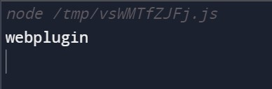

# Question 2

Complete the following javascript function that accepts the url and the parameter name and returns the value of that parameter.

<hr />

Name: Abhuday Mishra

Registration Number: RA1911003010669

```
var url =
  "https://www.kommunicate.io/poweredby?utm_source=https://www.kommunicate.io/&utm_medium=webplugin&utm_campaign=poweredby";

const storeArr = url.split("?")[1].split("&");
const parameter = storeArr[0].split("=");
const arr = [];
for (const item of storeArr) {
  const obj = {
    parameter: item.split("=")[0],
    value: item.split("=")[1],
  };
  arr.push(obj);
}
function getUrlParameterValue(url, parameter) {
  //Todo: complete this code
  arr.map((x) => {
    if (x.parameter === parameter) {
      console.log(x.value);
    }
  });
}

getUrlParameterValue(url, "utm_medium");

```

<hr />

# Output



<hr />
Submission for Question 2 Kommunicate.io by Abhuday Mishra
