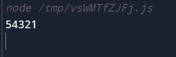

# Question 3

Write a javascript function that prints the reverse of a number. Example: if the number is 149, then output should be 941.

<hr />

Name: Abhuday Mishra

Registration Number: RA1911003010669

```
const num = 12345;

const reverseNum = (num) => {
  console.log(num.toString().split("").reverse().join(""));
};

reverseNum(num);

```

<hr />

# Output



<hr />
Submission for Question 3 Kommunicate.io by Abhuday Mishra
